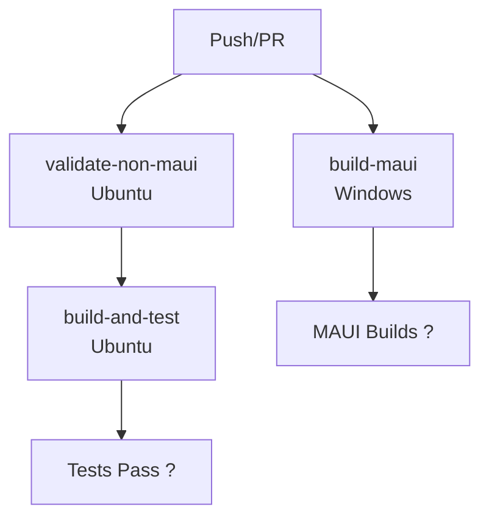

# GitHub Actions CI/CD Setup

This repository includes GitHub Actions workflows for automated building and testing across different platforms.

## Overview

The solution contains both **cross-platform projects** (Blazor, Core, API) and **MAUI projects** (Android, iOS, Windows, macOS). Since MAUI workloads are **only supported on Windows runners**, the workflows are split into:

1. **Ubuntu jobs** - Fast, cost-effective builds for non-MAUI projects
2. **Windows jobs** - Required for MAUI project builds

## Workflows

### 1. **ci.yml** (Recommended - Simple)

Two parallel jobs:

**build-non-maui (Ubuntu):**
- Builds Blazor WebAssembly app
- Builds Core library
- Builds API
- Runs tests
- Publishes Blazor artifacts

**build-maui (Windows):**
- Installs MAUI workloads
- Builds MAUI Android app
- Builds MAUI Windows app

**Triggers:** Push and Pull Requests to main, master, or develop branches

### 2. **build.yml** (Detailed with Validation)

Three jobs with dependency chain:

**validate-non-maui (Ubuntu):**
- Validates all non-MAUI projects can restore

**build-and-test (Ubuntu):**
- Depends on validation
- Builds all non-MAUI projects
- Runs tests
- Publishes Blazor app

**build-maui (Windows):**
- Runs in parallel with validation
- Builds MAUI projects for Android and Windows

**Triggers:** Push, Pull Requests, and manual workflow dispatch

## Platform-Specific Requirements

### MAUI Projects (Windows Only)

MAUI workloads are **NOT supported on Linux or macOS** runners. They require:
- `runs-on: windows-latest`
- `dotnet workload install maui`

Supported MAUI target frameworks:
- ? `net9.0-android` - Builds on Windows
- ? `net9.0-windows` - Builds on Windows
- ?? `net9.0-ios` - Requires macOS runner (not included in workflows)
- ?? `net9.0-maccatalyst` - Requires macOS runner (not included in workflows)

### Non-MAUI Projects (Cross-Platform)

These projects build on any platform:
- ? Blazor WebAssembly (`net9.0`)
- ? Core library (`net9.0`)
- ? API (`net9.0`)
- ? Tests (`net9.0`)

## Composite Actions

### setup-dotnet-maui (?? Windows Only)
Located in `.github/actions/setup-dotnet-maui/action.yml`

**IMPORTANT:** This action only works on `windows-latest` or `windows-*` runners.

This composite action:
- Sets up the .NET SDK
- Validates it's running on Windows
- Installs all MAUI workloads
- Fails fast if used on non-Windows runners

**Usage:**
```yaml
jobs:
  build-maui:
    runs-on: windows-latest  # ? REQUIRED
    steps:
      - uses: actions/checkout@v4
      - name: Setup .NET with MAUI
        uses: ./.github/actions/setup-dotnet-maui
        with:
          dotnet-version: '9.0.x'
```

**? Don't do this:**
```yaml
jobs:
  build:
    runs-on: ubuntu-latest  # ? WRONG! MAUI doesn't work on Linux
    steps:
      - uses: ./.github/actions/setup-dotnet-maui  # ? Will fail
```

## Workflow Strategy

### Why Split Jobs?

1. **Performance**: Ubuntu runners are faster and cheaper than Windows for cross-platform .NET builds
2. **Compatibility**: MAUI workloads only install on Windows
3. **Parallelization**: Non-MAUI and MAUI builds run simultaneously
4. **Cost Efficiency**: Only MAUI jobs use Windows runners (which cost more)

### Job Execution Flow



## Local Development

To set up your local environment:

```bash
# Install .NET 9 SDK
# Download from: https://dotnet.microsoft.com/download/dotnet/9.0

# For MAUI development (Windows only):
dotnet workload install maui

# Restore all projects:
dotnet restore blazor-app/SchengenCalculator.csproj
dotnet restore src/SchengenCalculator.Core/SchengenCalculator.Core.csproj
dotnet restore src/SchengenCalculator.Api/SchengenCalculator.Api.csproj
dotnet restore tests/SchengenCalculator.Tests.csproj

# For MAUI (Windows only):
dotnet restore src/SchengenCalculator.Maui/SchengenCalculator.Maui.csproj

# Build non-MAUI projects (any platform):
dotnet build blazor-app/SchengenCalculator.csproj
dotnet build src/SchengenCalculator.Core/SchengenCalculator.Core.csproj
dotnet build src/SchengenCalculator.Api/SchengenCalculator.Api.csproj

# Build MAUI (Windows only):
dotnet build src/SchengenCalculator.Maui/SchengenCalculator.Maui.csproj -f net9.0-android

# Run tests:
dotnet test tests/SchengenCalculator.Tests.csproj
```

## Projects in Solution

1. **SchengenCalculator (Blazor WebAssembly)** - Web application _(builds on any OS)_
2. **SchengenCalculator.Core** - Core business logic _(builds on any OS)_
3. **SchengenCalculator.Api** - Backend API _(builds on any OS)_
4. **SchengenCalculator.Maui** - Mobile/Desktop app _(requires Windows for build)_
5. **SchengenCalculator.Tests** - Unit tests _(runs on any OS)_

## Troubleshooting CI Builds

### Error: NETSDK1147 - MAUI workloads not supported

If you see:
```
error NETSDK1147: To build this project, the following workloads must be installed: maui-android
Workload installation failed: Workload ID maui isn't supported on this platform.
```

**Cause:** Trying to install MAUI workloads or build MAUI projects on a non-Windows runner (Ubuntu/macOS).

**Solution:** Ensure MAUI-related steps only run on Windows:

? **Correct:**
```yaml
jobs:
  build-maui:
    runs-on: windows-latest
    steps:
      - name: Install MAUI
        run: dotnet workload install maui
```

? **Wrong:**
```yaml
jobs:
  build:
    runs-on: ubuntu-latest  # ? Problem!
    steps:
      - name: Install MAUI
        run: dotnet workload install maui  # ? Will fail
```

### Error: Can't restore VBSCalc.sln on Linux

If restoring the full solution (`VBSCalc.sln`) fails on Ubuntu:

**Cause:** The solution includes the MAUI project which requires MAUI workloads.

**Solution:** Restore individual non-MAUI projects instead:
```yaml
- name: Restore non-MAUI projects
  run: |
    dotnet restore blazor-app/SchengenCalculator.csproj
    dotnet restore src/SchengenCalculator.Core/SchengenCalculator.Core.csproj
    dotnet restore src/SchengenCalculator.Api/SchengenCalculator.Api.csproj
    dotnet restore tests/SchengenCalculator.Tests.csproj
```

### Best Practices

1. ? Use `ubuntu-latest` for non-MAUI projects (Blazor, Core, API, Tests)
2. ? Use `windows-latest` for MAUI projects
3. ? Use separate jobs with specific runners
4. ? Restore individual projects instead of the full solution on non-Windows runners
5. ? Don't try to install MAUI workloads on Linux/macOS
6. ? Don't restore `VBSCalc.sln` on Linux (it includes MAUI)

### Workflow Template

```yaml
name: CI

on: [push, pull_request]

jobs:
  # Fast cross-platform builds on Ubuntu
  build-non-maui:
    runs-on: ubuntu-latest
    steps:
      - uses: actions/checkout@v4
      - uses: actions/setup-dotnet@v4
        with:
          dotnet-version: '9.0.x'
      - run: dotnet restore blazor-app/SchengenCalculator.csproj
      - run: dotnet build blazor-app/SchengenCalculator.csproj --no-restore
      # ... more non-MAUI projects

  # MAUI builds on Windows
  build-maui:
    runs-on: windows-latest
    steps:
      - uses: actions/checkout@v4
      - uses: actions/setup-dotnet@v4
        with:
          dotnet-version: '9.0.x'
      - run: dotnet workload install maui --skip-sign-check
      - run: dotnet restore src/SchengenCalculator.Maui/SchengenCalculator.Maui.csproj
      - run: dotnet build src/SchengenCalculator.Maui/SchengenCalculator.Maui.csproj -f net9.0-android --no-restore
